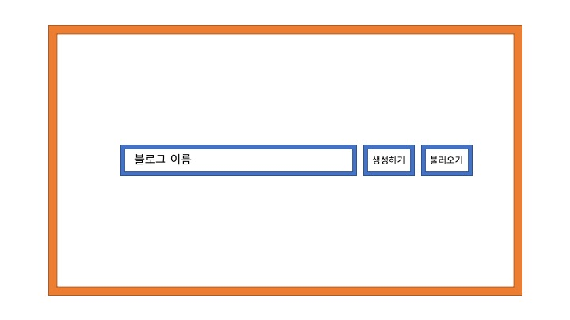
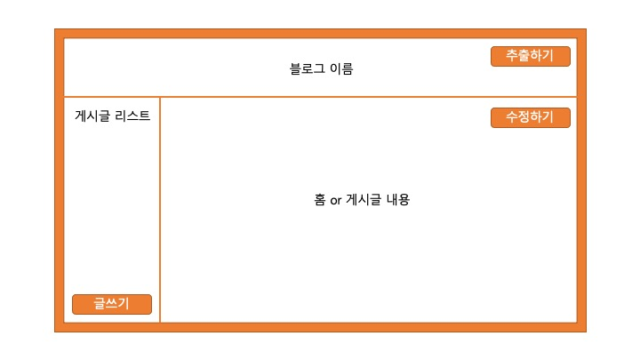
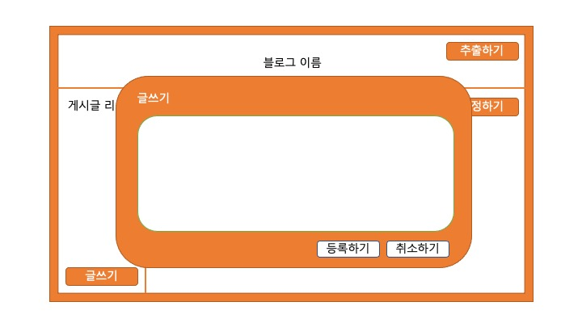
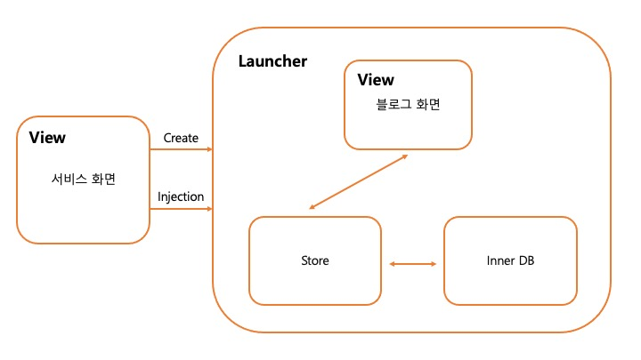

# 👩🏻‍💻 첫번째 미니 프로젝트 : Blog Launcher

- 임의로 사용자가 간단한 정보만 입력하면 나만의 블로그를 만들어 주는 간단한 **Launcher**를 만들어 볼 예정입니다.
- 간단하더라도 개발자의 관점으로 생각하여 작은 단위로 추상화하고 작은단위로 확장성 있게 개발할 예정입니다.
- 클린코딩에 집중할 계획입니다.

## 📺 스토리 보드

- 홈 화면



- 블로그 생성 및 불러오기



- 글쓰기 및 수정하기



## ⚒️ 아키텍처



## 🗂 파일구조

```
📁Front
├── 📁components
│   ├── index.tsx
│   └── styles.ts
└── 📁layouts
└── 📁pages
└── 📁hooks
└── 📁types
└── 📁utils
```
